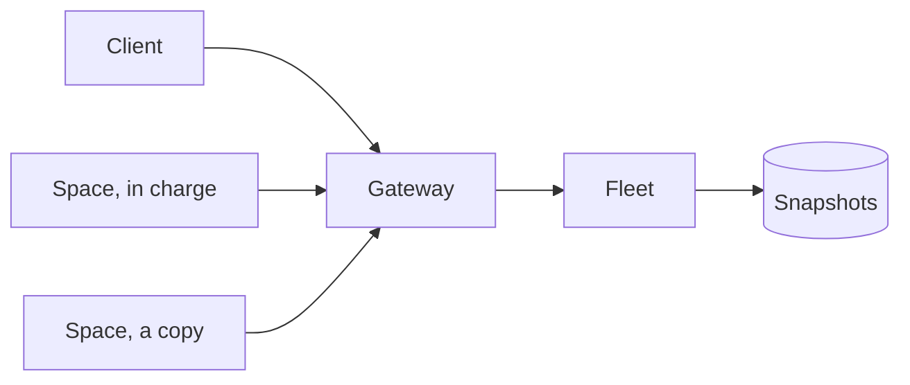
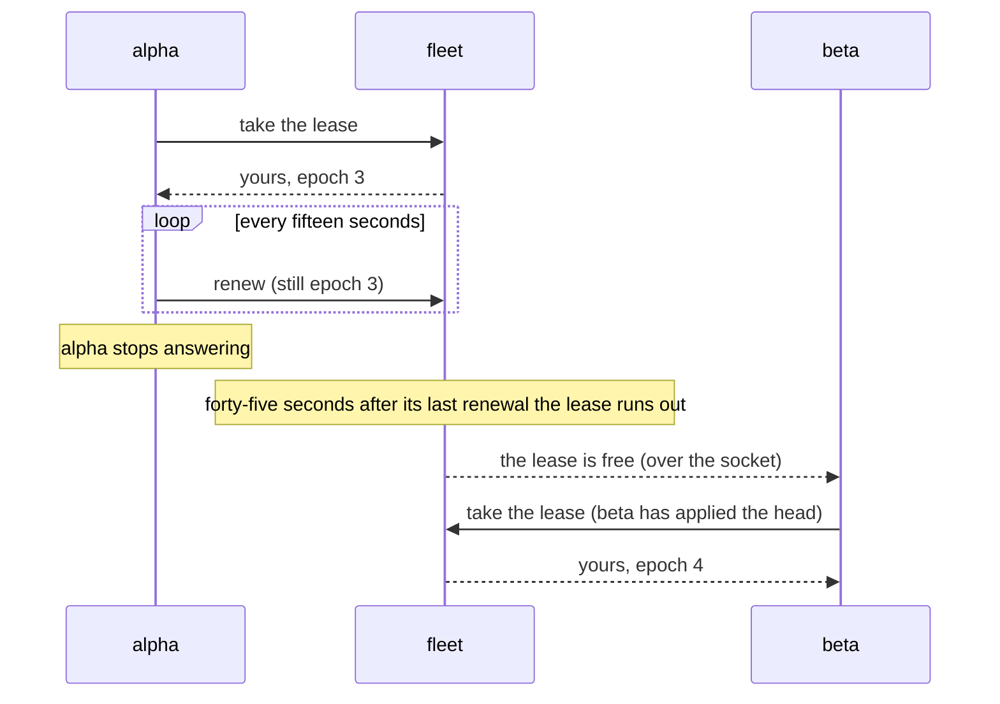
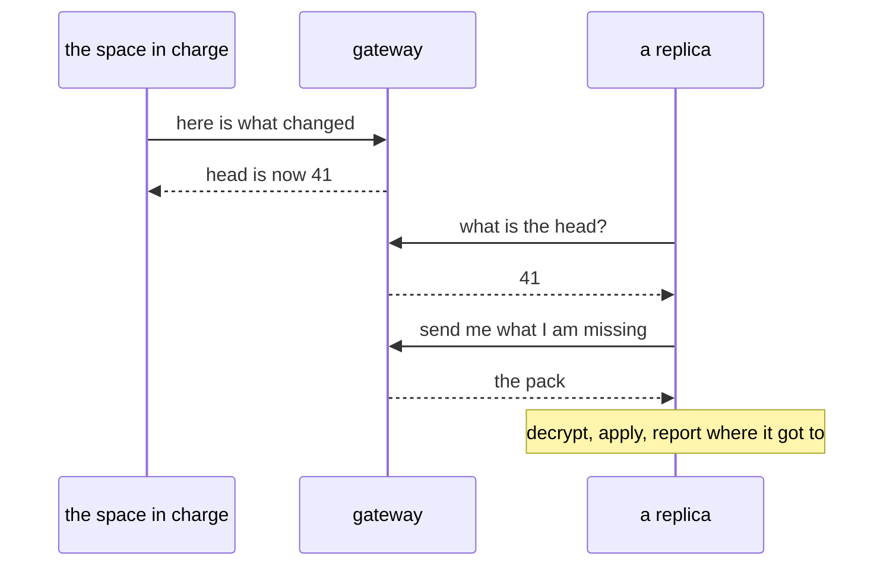

# Fleets

A fleet is a small team of spaces that hold the same work and can take over for
each other. One of them is in charge at any moment - it holds what the fleet
calls the **lease**. The others keep an identical copy and wait their turn.

A fleet is also a device: it answers to its own name, and the operator gives it a
token, so a client can reach the whole fleet without being one of its spaces.


```mermaid
flowchart LR
  client[Client] --> gw[Gateway]
  spaces[Space, in charge] --> gw
  mirror[Space, a copy] --> gw
  gw --> fleet[Fleet]
  fleet --> r2[(Snapshots)]
```

## Why a fleet

A machine goes to sleep, a laptop closes, a container is recycled. A fleet is how
one piece of work survives that: it is in several places at once, and the place
that is answering changes without anybody having to redirect a call.

The work is not copied by hand. Whatever is written in the space that is in
charge is packed, sealed, and carried to the others.

## One is in charge

At any moment exactly one space holds the lease. That one writes. The others are
**replicas**: they keep a copy ready, and they never write.

The lease is short - forty-five seconds unless the operator sets another for the fleet (see below) - and the one holding it renews every fifteen
(a third of it), on a beat of its own, whatever its rounds are doing: a primary whose
snapshots keep failing (a file it cannot read, a pack the gateway refuses) still holds its
place. A renewal that is lost on the way is tried again two seconds later, and a request for
the place is cut off after ten seconds, so even two failures - each as slow as it may be -
leave a third attempt before the place is gone. A renewal the gateway answered with a refusal
(too many requests, over budget) is not hammered: it is asked again when the gateway said to
(`retry-after`), and in any case within a third of the lease. A space that goes quiet loses
the lease quickly rather than locking the fleet: when it runs out the fleet tells every member
over its socket, and a replica that is current takes over in the rest of the lease plus a few
seconds - about a minute from the holder's last renewal. A request that fails while a replica
is taking over is asked again after a short wait that doubles (three seconds, six, twelve, ...),
not after the replica's usual rest, so one failure costs seconds; a replica that is behind first
has to catch up (see below).

**The lease is the fleet's, and the operator sets it.** The gateway's `FLEET_LEASE_MS` is the default for fleets
that have none of their own (45 seconds when unset), and a fleet's own is set with `POST /fleets/{fleet}/meta`
`{"leaseMs": 90000}` by the operator's token or the fleet's owner, or by `POST /admin/api/fleets/{fleet}/meta`
from the admin page (`null` goes back to the gateway's). It is held between **30 seconds and 3 minutes**, and a
value outside that is refused, not clamped, so nobody believes a fleet runs on a lease it does not. The holder
does not choose its own: a renewal that asks for a longer time gets the fleet's (it used to get what it asked, up
to five minutes). A change reaches the holder at its next renewal, and the members that listen are told over their socket
(`{"type":"lease","leaseMs":...}`) and in every bootstrap answer (`ttlMs`, replicas' too); a member of an earlier build only
reads the lease at its first hello, so it picks up a change when it restarts. The fleet's owner may set the lease, and the
operator can set it over the owner's; only the operator can go below 30 seconds (`FLEET_LEASE_MIN_MS`, for tests). What the choice trades:

| lease | renewals each primary makes (once the agent beats at a third of it) | cost of renewals, per fleet-month | a dead primary is replaced within |
|---|---|---|---|
| 30 s | every 10 s | about $0.46 | about 45 s |
| **45 s (default)** | every 15 s | about $0.31 | about 1 min |
| 90 s | every 30 s | about $0.15 | about 1 min 45 s |
| 180 s | every 60 s | about $0.08 | about 3 min 15 s |

(The cost is a renewal's storage rows - one and a third on average - and its two requests, at list prices and
before the free allowances; the failover is the lease plus about fifteen seconds for the alarm and the take-over.)
Below 30 seconds an agent of an earlier build, which renews every fifteen at most, would have fewer than two
renewals in a lease and could lose the place to one late one; above three minutes a crashed primary leaves the
fleet without one for too long to be a failover. **An agent that is not yet a build that follows the lease still
renews every fifteen seconds** (at most), so a longer lease saves its cost only once members are on that build.
A paused or quiet fleet costs nothing either way.

**A member of this build follows the lease.** The length of the lease is the fleet's, not the agent's: every member takes it from what the fleet says - the hello
of its socket (each time the socket opens), a `lease` frame when the operator or the owner changes it, and the answer
to every ask for a place - and the newest word counts. The primary renews at a third of it, up to a minute (the
longest lease the gateway allows, 180 seconds, is renewed every 60), so that a longer lease costs fewer renewals; a
replica without a socket looks at the same pace. `PRIME_FLEET_HEARTBEAT_MS` can only lower that, and not below 15 seconds while the member's socket is up. The owner or the operator sets
it with `prime fleets set <fleet-id> --lease 90s` (`2m`, or `default` for the gateway's own; the gateway holds it between 30
seconds and 3 minutes and says so when a value is outside).

**What each member can do** is said in its bootstrap (`caps`, a short list of lowercase names, sorted and without
repeats), kept in the roster and written only when it changes, handed to the primary with the members' keys, and
answered as `fleetCaps` (what every member can do) by `/role`. `fleetCaps` is advisory: it is what the members *say*, and the gateway does not check it, so it may only choose between formats
that are all safe to read. A feature that protects something (a ratchet, a signature rule) is enforced by a floor in the
member's own code, never by `fleetCaps` alone. A format that not every member can read is used only
when every member lists it; an earlier build says nothing, so the fleet's list is then empty. The gateway only
relays what a member says: one that lies can keep the older format in use or make a member that cannot read a
newer one fail to open it, which it can already do by withholding it.


```mermaid
sequenceDiagram
  participant A as alpha
  participant F as fleet
  participant B as beta
  A->>F: take the lease
  F-->>A: yours, epoch 3
  loop every fifteen seconds
    A->>F: renew (still epoch 3)
  end
  Note over A: alpha stops answering
  Note over F: forty-five seconds after its last renewal the lease runs out
  F-->>B: the lease is free (over the socket)
  B->>F: take the lease (beta has applied the head)
  F-->>B: yours, epoch 4
```

The **epoch** goes up every time the lease changes hands. A space acts only under
the epoch it was given, so a slow publisher from before the change is refused
instead of writing over the state the fleet has moved to.

## What a change does

The space in charge watches its work tree. When something changes it builds a
pack of what is different, seals it for the members' keys, and advances the head.
A replica is told that the head moved, and fetches what it is missing into its own
store in the background (see "A replica does not mirror all the time" below).


```mermaid
sequenceDiagram
  participant P as the space in charge
  participant G as gateway
  participant R as a replica
  P->>G: here is what changed
  G-->>P: head is now 41
  R->>G: what is the head?
  G-->>R: 41
  R->>G: send me what I am missing
  G-->>R: the pack
  Note over R: decrypt, apply, report where it got to
```

The gateway never opens a pack. It is sealed for the members' own keys, so the
gateway carries boxes it cannot read. Nor does a member take its word for what a
box is: see "What the gateway can still do" below.

### A replica does not mirror all the time

A replica does not write what the fleet publishes into its work tree as it arrives.
When the head moves it **fetches**: it downloads the new snapshots, opens them with
its own key, checks each against its manifest and keeps them in prime's object store
beside the work tree. The work tree is written out - once, for however many snapshots
it is behind - only when it has to be:

- when the replica is about to **take over** (the fleet only gives the lease to a
  member that has applied the head), so a replica that is promoted is current before
  it accepts a write;
- when a person runs **`prime fleets sync --space <name>`**, which fetches what is
  missing and applies it;
- the first time, so a member that joins has files to start from.

**A lazy replica's work directory may be behind the fleet, and it is stale by design.**
What it holds is always a snapshot the fleet really had (the last one applied), never
a half-written mix. If something reads a replica's directory and must see the
newest state, run `prime fleets sync`, or set `PRIME_FLEET_REPLICA=mirror` for the
agent: it then writes every snapshot as it is fetched, as replicas did before. The setting is
passed to the agent and written down in its directory (`fleet-agent/settings.json`), so an agent
started by the login service, or restarted after a crash, has it; `prime fleets agent status` says
which mode it is in. See "The agent's settings" below for how they are set, changed and cleared.

The member's state file records both positions (the agent and `prime fleets sync` both write it, under a lock, and neither position is ever written back to an earlier snapshot than the file already holds; and they write the work tree one at a time, each recording what it wrote before the next starts, so a sync that planned to an older head than the agent has since applied writes nothing instead of putting the older snapshot over the newer): `seq`, `base` and `tree` are what the
work tree holds, and `fetchedSeq`, `fetchedCommit` and `fetchedTree` the newest snapshot
in the store, never behind it. `prime fleets agent status` shows what the agent last did
("fetched 41", "applied 41", "took over at 41").

Fetching is cheap: a replica that is up to date asks nothing, a socket that says "the
head moved" starts one fetch, and the route to the head is the cheapest the replica can
find (see "A replica that fell behind"). A replica takes its place in the fleet when the
agent starts, when the fleet says the lease is free, and as a safety: every fifteen seconds
without a socket (the answer says where the head is, so it asks for nothing else), every five
minutes with one. It does not renew a lease it does not hold.

When the lease is free, replicas that are behind each need to write their work tree to take
it, and only one can. The first to ask is told to catch up and holds a claim on doing so for
thirty seconds (renewed whenever it asks again, but a claim lasts sixty seconds in all); the
others are told to wait, write nothing, and ask again when the claim runs out - and are kept
in the order they asked: when a claim ends the next is given to the one that has waited
longest, and one that asks every second does not overtake one that was told to ask in thirty.
A claimant that died half way costs the others that wait. One that is alive and cannot catch up
- nothing is sealed for it yet, it has lost its key, its work tree cannot be written - has the
claim for its sixty seconds, then goes to the back of the line, and takes it again only if nobody
is waiting; a current client in that state also stops asking for the lease until something
changes. So a replica that can catch up takes over after the claims of the replicas that were
waiting before it: about a minute for each of them that is stuck (measured on the gateway's own
code with a stuck replica ahead of a healthy one: 65 seconds with one stuck, about three minutes
with three), not however many there are. Who actually gets the lease is decided as ever: a
member that has applied the head - a replica that finishes catching up after its claim ended
still takes it.

### What a replica keeps

The fleet carries the files in the primary's work tree, except what git ignores
(`.gitignore`) and except nested git repositories - directories that have their
own `.git`. Those two are never sent, and a directory that was synced and then
became a repository is no longer published (the copies other replicas already
have stay where they are).

A change is taken once the files a snapshot would take have been still for 50 ms
(`PRIME_FLEET_SETTLE_MS`): two looks that far apart find every file's size, times and
identity unchanged, and none of them was written in the last 50 ms. A writer that pauses
for longer between two writes can be captured part-way, and its next write publishes the
rest. Where a file system keeps whole seconds for its times, the look is repeated until the
last write is a couple of seconds old. A tree that is written to without a pause (a log that
is not in `.gitignore`) is published at most every few seconds: after publishes that follow
each other within a second, the next change is held back a second, then two, and so on up
to 5 s; a change after a pause is never held.
On Windows, git cannot see a rewrite that keeps a file's size and puts its old write time
back (it looks at neither the change time nor the identity there), so such an edit may not
replicate until the next change to the content. That is git's own behaviour, and it was so
before the quiet period was shortened.

The primary also leaves what git ignores out of what makes it look at the work tree: a
build writing into `node_modules` wakes nothing. That is asked of git itself, with the
rules the snapshot uses (every `.gitignore` of the tree, the store's `info/exclude`,
`core.excludesFile` and what its configuration includes), and a file the last snapshot
holds is never left out, ignored or not. A path git cannot say anything of, or does not
answer about in a moment, is not left out.

When a snapshot arrives, the replica writes the files it has and removes the
files the *previous* snapshot had and this one does not: the ones the primary
deleted. A removal stays inside the work tree (a directory turned into a symlink
is not followed) and only takes a file whose name matches exactly, so a rename
that changes only the case keeps its file on a file system that folds case.

A name is carried as git stores it. On macOS a folder written with a decomposed
accent (`Cafe` plus U+0301, the form HFS+ and some tools produce) reaches the
replicas as the composed `Café` (U+00E9): git's `core.precomposeunicode` makes
that choice for every name it records. Nothing is lost (the files and their
content arrive, in one folder), but the name's bytes on a replica are not always the primary's.

What the fleet never carried is not removed by an apply: git-ignored files
(`.env`, `node_modules`, build output) and nested repositories are untouched.
Two things are not "left alone", and they are not deleted either:

- a file that is not ignored and that the fleet did not give the replica (a note
  someone wrote in the mirror) is a local change, like an edit to a file the fleet
  carries. Before the replica is brought up to date, the changed paths - only
  those - are moved into `local-change-<time>` beside the work tree. A lazy replica does
  that when it is brought up to date (promotion or `prime fleets sync`), not on every head;
- if the fleet turns a directory into a file, git cannot keep both: the ignored
  files inside that directory go with it.

The first snapshot a replica applies has no previous one to compare with. It
removes nothing: a stray file is better than a lost one, and from the second
snapshot on the replica knows exactly what the fleet put there.

### Taking over

A member that has not caught up cannot be promoted: a new space in charge applies
every snapshot up to the head before it accepts a single write. A space in charge
that starts behind the head would fork the fleet, and the fleet refuses it rather
than trusting it.

### A replica that fell behind

Most snapshots carry only what changed. Every 32nd carries the whole tree, as an
anchor - the tree's own files, not the history before it, so its size follows the
tree. A replica that was away starts from the newest whole tree and applies the
changes after it, at most 32 snapshots, however far behind it is. How far behind
one replica is changes nothing for the others: the space in charge goes on
publishing small changes. The gateway keeps the last 64 snapshots, twice the
interval, so the newest whole tree and every change after it are there.

Each snapshot names the head it was built on, whoever published it, so the chain
a replica walks stays whole when the space in charge changes hands. A snapshot
can only be opened by the members it was sealed for; if the chain starts before a
member joined (or before it came back with a new key), it waits for a snapshot
sealed for it - the next change of members, or the next whole tree.

The chain is downloaded and opened before the first step is applied, and each step
is recorded as it is applied. A catch-up that fails part-way leaves a state that
still describes the work tree, so nothing the fleet wrote is taken for a local
change.

A whole tree is also published when a member is added or comes back with a new key (a
swap of one space for another counts), because a snapshot can only be opened by the
members it was sealed for. Each wrapped key says which of the member's keys it is for, so a
member that came back with a new key is routed round the snapshots sealed for its old one. A
member that only left needs no whole tree: the next snapshot is not sealed for it, which is
what keeps it out. A member that has just joined, with nothing yet sealed for it, is told so
after one request and waits for the primary to notice.

**The route a replica takes is the cheapest it can find**: either all the changes since
what it holds, or a whole tree at some checkpoint and the changes after it. Each step
counts its pack's bytes and 24 KB more (two round trips, a manifest, two git processes), so
forty changes of a few hundred bytes are not worth forty round trips when the whole tree is
14 KB, while thirty-nine of 1.5 KB against 1.9 MB are.
A checkpoint carries both - the whole tree, for a newcomer, and the change since the
snapshot before it, sealed with the same key, for everyone who is up to date - so a
replica that follows every snapshot never downloads a whole tree again. The gateway keeps
an index of its snapshots (which are whole trees, how big the packs are), so a replica
works the route out in one request, then fetches the manifests of the snapshots on it
side by side; a gateway without an index is walked manifest by manifest. Older members
ignore the second pack and take the whole tree, as before.

### What the gateway can still do

The gateway stores every manifest in the clear, and decides which one is the head.
So a member does not believe a manifest because the gateway served it. A snapshot is
checked, as it is opened, in three ways (`cli/src/fleet-trust.ts`):

1. **The seal.** The publisher makes a tag (an HMAC, derived from the snapshot key) over the
   fleet, the sequence, the snapshot it follows (the hash its manifest is stored under), the
   commit, the tree, whether the pack is a whole tree, the hash of each sealed pack, its own
   key, the roster and which fleet of that name it is (an id the gateway makes when a fleet is
   created; a fleet that is deleted frees its name, and a sealed snapshot of the earlier one that
   is replayed into a new fleet of the same name names the other id), and puts it in the manifest
   (`seal`). Only a holder of the snapshot
   key can make it, and the snapshot key is only ever wrapped for members. A replica checks
   the manifest against it after it opens the pack, and the pack against the hash in it. A
   manifest the gateway edited, an old snapshot shown under a newer sequence, a tree or pack
   of another snapshot, a snapshot of another fleet: none match, and the snapshot is refused
   before anything is written. (Sizes are not sealed: they only choose the route.) A manifest
   is also read by the hash it is stored under, so the one that comes back is the one that was named.
2. **The sender.** The seal proves "someone who holds this snapshot's key", and every member that
   ever held it - one that has since been removed too - can make it. So each member's entry of
   `wrapped` also carries a tag (`mac`) over the same fields, made with the secret that only the
   sender and that member can derive (the Diffie-Hellman of their two keys). A replica checks it
   against the key the manifest names as the sender's: a removed member that kept an old snapshot
   key cannot put a current member's name on a snapshot, because it cannot make the tag for any
   other member. (It is an added manifest field: older replicas ignore it.)
   And the key the snapshot was made with has to be one the roster lists. The roster is read once for
   a catch-up and kept in `<space>.key.trust.json` beside the key file, each key with the highest
   sequence of a snapshot that was checked with it while it was on the roster: nothing credits a key
   for snapshots that were not looked at. A member that leaves is remembered by the fleet with the
   sequence the head was at when it did (the roster lists it as `left`, with `until`; a key a member
   replaces on joining again is listed the same way), so a member that was away while the primary
   published and then left still takes in what it made, and takes over; and the key is trusted for no
   snapshot after that sequence. A member that is removed while its own publish is in flight has that
   snapshot covered too: the fleet raises `until` to it when the write lands. Up to 256 such keys are
   kept, and one is dropped once the snapshots it could have made are out of the retained history. So a removed member cannot publish with
   its own key, provided the gateway was honest about the roster while it was a member. Otherwise the
   gateway could make a key pair of its own, wrap a snapshot key of its own for each member and seal
   its forgery itself.
3. **No going back.** Publishers older than this have no seal (or, for the tag above, no tag), and
   their snapshots are still accepted - but once a member has taken in a snapshot with a seal (in
   order, and only once it is taken in: not one that was merely downloaded ahead), an unsealed one at
   or above the lowest sealed sequence it has taken in is refused, and likewise for a snapshot that has
   a seal and no tag for this member. The lowest of each is kept in the same file (`sealedFrom`,
   `macFrom`). A snapshot that is refused this way is gone around, not waited for: the
   replica plans its route again from the next whole tree, and a publisher that finds an
   unsealed head publishes a whole tree for that reason.

Whose word this rests on: **the roster**. The operator admits the members, and the
roster says which key each has. The checks hold against anyone who can read and write what
the gateway stores - a bucket, a backup, a replay of old storage, a bug - against a gateway
that edits or reorders manifests, and against a removed member that is helped by the gateway
to serve what it makes - provided the gateway was honest about the roster, and about when a member
left, while that member was in the fleet. They do not hold against a gateway that also lies about the roster:
one that adds a key of its own to the list it serves, or swaps a member's key for its own, can then
author snapshots (for the members that read that roster) **and read what the fleet publishes after that**:
the primary seals every snapshot for every key on the roster it is served, so a key the gateway adds is given
the snapshot key of each later snapshot, and opens it. That is visible only to someone who compares:
`prime fleets members` prints a fingerprint of each member's key (the KEY column), and a swapped key
keeps the device and changes only that. The fingerprint is 128 bits, in two halves joined by a dot
(`xxxxxxxxxxx.yyyyyyyyyyy`); its first half is exactly what builds before it printed (without the final
`=`), so a member on an earlier build is compared with by that half, and two machines of this build
compare both. A gateway that grinds for a key matching a fingerprint needs about 2^128 work, where it needed
2^64 for the eight bytes that were printed. The fingerprint has to be checked outside the gateway
(against what the member's own `prime fleets members` shows) to mean anything; the admin page
shows it too, in the tooltip of each space (with how far the member says it has applied and fetched:
informational, the gateway decides nothing from `fetched`), and it is the gateway's own page, so
it is no more than the roster is. A member that was removed and that the gateway
helps can still read what it was sent before it was removed, as it always could.

What a credential on its own can no longer do, and what the gateway still can.

- **A member's device token cannot replace the key of that member.** The token of a space is a short code (an
  anonymous device's is 25 characters, 129 bits; one made before that is six: see "Codes made before" below), which the space also keeps in its environment. The fleet takes a
  member's new key only on a proof made with the member's old private key (checked by the fleet object, which
  has an X25519 key pair of its own), or when the operator or the owner approves it. A request for a new key
  shows its fingerprint (`prime fleets pending`, the admin page), to compare with what the member's own machine
  prints before approving. What this does not cover: **the owner's device token** is the owner's authority over
  its fleet, so it can still invite a device of its own and admit it (a new member, with a key of its own),
  and it can approve the request of another member; it cannot approve a new key for the owner itself, nor
  replace the owner's key without the old key's proof, since that takes the operator. A member's `applied`
  sequence is held to the head, not below it: a member can still report exactly `head.seq` without having
  taken that snapshot in, and so can be handed the lease at the head; what it cannot do is report a sequence
  the fleet has not published.
- **The gateway token does not run fleets.** Every machine and client of the gateway holds it. The operator
  has `FLEET_OPERATOR_TOKEN`.
- **The gateway itself is not stopped by either.** It runs the fleet object, so it can still write the roster
  it serves, and the proof above is checked by the gateway's own code. A key the operator approves is
  trusted on the operator's word: a request that comes from somebody who holds the device's token (an attacker
  who overwrote the member's waiting request with a key of its own, say) is approved by an operator who does not
  compare the fingerprint.

What the gateway can still do, whatever a member checks:

- **Run commands on any connected space.** The tunnel of a space executes whatever call the gateway sends
  it, with no check on the space's side of who sent it, so the gateway (or whoever controls its deployment or
  its Cloudflare account) can call any tool - `bash` included - on any space that is connected to it. The
  calls a client makes and what they return pass through the gateway in the clear as well, so what a
  space is asked to read or run is visible to it. This does not depend on fleets or on the roster, and nothing a
  member checks of a snapshot protects it. A gateway you do not trust with the machines on it is a gateway
  those machines should not be connected to.
- **Read the work tree through a lying roster**, not only author it (see above): a key it adds is sealed for
  by the primary.
- **Stop the fleet**: not serve, not store, not move the head.
- **Show an older head** (a rollback): a member sees a snapshot that is real and was the
  head once. It cannot be shown as newer, so a member that holds a higher sequence ignores it,
  but a member that has never seen the newer ones cannot know they exist.
- **Show different members different histories**: each is a real chain; the members
  find out when they take over and publish on a head the others do not have.
- **Roll out slowly**: until every publisher has the seal, a replica that has not yet seen a
  sealed snapshot takes unsealed ones, so an unsealed old snapshot of an old publisher can be
  shown as a new one to a member that never saw a sealed one. Once the fleet has a sealed snapshot,
  the gateway does not move the head to one without a seal ("this fleet's snapshots are sealed: upgrade
  prime on this member"): an old member that was promoted is told so, its lease goes to another member
  (an upgraded one takes it), and it carries on as a replica, which it can, since older builds read
  sealed snapshots. (Deploy the gateway before the members.) That is a rule of the gateway about
  availability, not a check a member relies on: a member that has seen a sealed snapshot refuses an
  unsealed one at or above it whatever the gateway lets through ("it carries no seal ..."), and goes
  around it by the next whole tree. The bar that keeps the old member from the lease again lasts ten
  minutes, and ends when it asks for its place as a build that seals (the bootstrap says so); a sealed
  fleet whose only members are old builds does not move until one is upgraded.
  A gateway with the gate says so (`/role`), and then a snapshot without a seal is reported as
  tampering: an old member cannot have published it through that gateway, except for a head that
  was written before the gateway had the gate (it reads the sealed tip's manifest once if the index
  did not say, so only a tip that was not sealed at all escapes). Either way the refusal names the
  manifest's hash, and what the manifest itself says of when it was made and with which key (the
  fingerprint `prime fleets members` prints, to compare with the KEY of the member that is gone; with no
  seal nothing proves it, so it is something to check, not a check), and when that member was lost and no upgraded member can take over (the catch-up
  to that head is what is refused), the operator of the member that cannot go on may run
  `prime fleets trust accept <fleet> --space <name> --manifest <hash>`. **That trusts the gateway for
  that one snapshot**: the member cannot tell it from an old snapshot the gateway made up (a rollback
  of the whole fleet to it), and if the member is promoted its next publish, a whole tree, republishes
  it to everyone. There is nothing here to compare the hash with once the publisher is gone: it is
  the operator's call. It lowers nothing the member has seen, and it only takes a snapshot without a
  seal: a snapshot with a seal and no sender's tag, or no mark of its fleet, after ones that had them
  is refused as tampering, and there is no command to take it.
  **Builds from before this was released**: members built from the intermediate fleet test builds
  (the ones that already sealed the incarnation, with a `v1:` seal, or no tag at all) are not all
  interoperable with a release: a seal over the incarnation is read under either prefix, but a build
  without the sender's tag in an entry is refused as tampering once a member has seen one. They are to
  be upgraded together. Released builds (without a seal) are read as always.
  Older replicas read sealed snapshots as they did before (the packs are unchanged; the tag is
  an added manifest field), so mixed fleets keep working in that direction.
- **Know who is in the fleet, how big the work tree is, and when it changes.**

## Joining

The operator makes the fleet - from `/admin`, or with `prime fleets create` where
the gateway's fleet operator token is at hand (`--operator-token`, or `PRIME_FLEET_OPERATOR_TOKEN`).
Nowhere else: a space cannot bring a fleet into
being. The spaces join, and the operator admits them.

```bash
prime fleets create acme              # the operator makes it
prime fleets invite acme              # a code that works once, for ten minutes
prime fleets join acme --code p1_...  # a space asks to join
prime fleets pending acme             # who is waiting
prime fleets approve acme --member <id>   # let it in
prime fleets members acme             # the roster
```

The invite makes the admission deliberate:

- **one code, one device**, whether or not approval follows;
- **ten minutes** by default, an hour at most;
- **stored as a hash**, so a dump of the store yields no usable code;
- **an invitation, not an identity** - it says somebody was asked, not who is
  holding it. That is why the operator sees the request and approves it.

A space that asks to join waits. Its agent keeps asking until it is let in.

## Use cases

- **A repository that follows you.** A fleet of three spaces on three machines,
  all holding the same checkout. Start a long job on any of them; when that
  machine stops, the next one carries on from the same point.
- **A workspace that survives a laptop.** The desktop holds the lease, the laptop
  and the space on a server keep copies. Close the lid, keep working.
- **One address for a whole team of machines.** Give the fleet a token, and a
  client that knows nothing about its spaces can run a tool on the fleet as if it
  were one machine.

## Talking to a fleet

The fleet is a device with its own name, so a client reaches it the way it
reaches any device:

```bash
prime tools call --device acme --token <fleet-token> bash '{"command":"ls"}'
prime tools call fleet:acme.bash '{"command":"ls"}'    # from inside a space of the fleet
```

The call goes to whichever space holds the lease, and the answer comes back the
same way. Nobody has to know which machine ran it.

A **member** may also address the fleet through its own device token: the fleet
checks membership instead of the fleet token. And a space that has stopped its
agent stops holding the lease, so a call made in the gap fails with a plain
"no primary right now" rather than hanging.

### Only the space in charge is entered

`prime spaces enter` works on any space that is not in a fleet. In a fleet it
works only on the space in charge: a fleet is several copies of one piece of
work, and an edit made in a replica is moved aside the next time it is brought up to date.

The answer comes from the fleet, not from the configuration file, so a space that
has just taken over can be entered at once.

## In the admin page

Each fleet is a card, with its spaces under it. The marks say what is going on:

| mark | means |
|---|---|
| cloud filled | a token, not paused, and a space holds the lease |
| cloud outline | one of those is missing: no way in |
| green border | that space holds the lease |
| red ring | that space is not connected |
| grey card | the operator switched it off |
| dashed card | a space asking to join, with Admit and Decline |

Beside the fleet tree, **Buddies** carries a row for the fleet itself: its name -
the id a client uses - and its token, masked, with a short fingerprint of it in
the tooltip. The gateway keeps only that fingerprint, never the token.
**Refresh token** makes a new one and shows it once, because there is no second
chance.

## What was done to a fleet

Each fleet keeps a log of what was done to it, who did it and when, in an order nobody can change afterwards. It
is written by the fleet's own object, so there is nothing to switch on.

**What is written:** the fleet made, deleted (by the operator, by its last member leaving, or cleared away because
every member was gone) and changed (its name, its pause, its lease); an invite made (its lifetime, never its code)
and the invites revoked; a space's request to join, an admission, a removal or a decline; a member's request for
another key, and a key replaced (by the operator's approval or by the proof of the old key, with the two
fingerprints); the lease taken by a new holder (never a renewal), given up, or taken out of the running; every
snapshot published (its number, its manifest's hash, the epoch and the key it was made with); the fleet's own
token set or cleared (that it was, never the token); and every call relayed to the primary (the method, the tool's
name and the size of the body - **never what the call asked**, and never what it carried).

**Who:** `operator` (the operator token), `access` (a person who signed in through Access, by e-mail, or a service
token by name), `owner` (the fleet's owner device acting as its operator), `device` (a member, by its id),
`fleet-token` (a client that came with the fleet's own token) and `gateway` (the gateway on its own account, as
when it takes a silent holder out of the running). A device is always itself: the header that names an operator is
set by the gateway and dropped from every request it takes in. No address is kept.

**The chain:** every entry carries the SHA-256 of the entry before it, so removing, changing or reordering one shows
in the one after it. `head` (the number and hash of the last entry) is what to keep to check later reads against;
`brokenAt(entries, prev)` in `api/src/fleet-audit.ts` is the check. The log is the gateway's own word: whoever holds
the gateway's storage can rewrite all of it, and a head kept somewhere else is what tells that they did.

**Reading it:** `GET /fleets/{fleet}/audit?after=N&limit=M` (the operator token, Access, or the fleet's owner),
`GET /admin/api/fleets/{fleet}/audit?tail=100` (the admin page's **Audit** item on a fleet). It answers
`{entries, head: {n, hash}, first}`; `first` is the oldest entry the fleet's object still holds.

**How big it gets:** the object keeps the newest 10,000 entries. When it holds 11,000 the oldest 1,000 go to the
bucket as one file, `audit/<fleet>/<time>-<first number>.jsonl`, and out of the object; the first entry that is left
carries the hash of the last that went, so the chain runs across the two. A fleet that is deleted has everything it
holds copied there too (outside `fleets/<fleet>/`, which is cleared with it), so what was done to a fleet outlives it,
and a fleet made again under the name starts a log of its own. The copy to the bucket is made with nothing else
waiting for it: a decision that is made while it is in flight (an invite, an admission, a lease taken at a failover) is
answered at once. If the bucket cannot be written for so long that the object holds 30,000 entries, the oldest
thousand are dropped without a copy and an `audit-dropped` entry says which; an entry that could not be stored at all
is counted and the reader is told (`unrecorded`). Neither stops the work. A delete while the bucket is down **keeps**
the log in the object (the answer says `auditKept: false`), and a fleet made again under the name carries on from it
with a `fleet-recreated` entry; the next trim copies it. A file's name is `audit/<fleet>/<time>-<first number>.jsonl`
and its object metadata says whose it is (`fleet`, `incarnation` when known, `first`, `last`); an object that does not
know its fleet's name (it is stored when the fleet is made, and said by every request) archives nothing.

**After the fleet is gone, and for how long:** `GET /fleets/{fleet}/audit` answers 404 once the fleet is deleted. The
operator reads what was kept at `GET /admin/api/audit-archive/{fleet}` (the files) and `...?file=<name>` (a file's
lines). The files hold device ids, labels, Access e-mails and key fingerprints, and **nothing expires them**: set a
lifecycle rule on the `audit/` prefix of the bucket for the period you are willing to keep them (for example 400 days:
`wrangler r2 bucket lifecycle add <bucket> audit-expiry audit/ --expire-days 400`), and delete `audit/<fleet>/` by hand
when a fleet's record must go sooner. The orphan sweep never touches `audit/`.

**What it costs:** a row written for each entry, and one more when the entry is trimmed away: about two rows
a publish or a relayed call. A fleet whose agents publish every few seconds and whose clients call a tool every
few seconds makes about 150,000 entries a month, which is $0.15 to $0.30 a month in rows at list prices, and a few
megabytes in the bucket. The log of a relayed call is written by the question that asks who the primary is, so it
adds no request. A call is written only when the fleet has a primary to send it to (`target` is that primary); a call
that is answered 503 because there is none writes nothing, and one whose primary is then found unreachable is followed by
the `lease-vacated` entry. A gateway whose relayed calls are many can leave them out: `FLEET_AUDIT_RELAY=0`.

## Three credentials, three jobs

| Credential | Belongs to | Can do |
|---|---|---|
| fleet operator token (`FLEET_OPERATOR_TOKEN`) | the operator | create fleets, mint invites, admit and remove, delete, list every fleet |
| device token | one device | speak for that device: join, sync, take the lease |
| fleet token | one fleet | reach the fleet and nothing else: it cannot join, admit or publish |

The **gateway token** (`GATEWAY_TOKEN`) is none of these: it is what every machine and MCP client of the
gateway is configured with, and it does not run fleets. It used to be the operator's credential as well,
which made every client an operator of every fleet; the operator's credential is now a secret of its own that
no client needs. A gateway that does not set `FLEET_OPERATOR_TOKEN` has no token operator at all: the admin
page (behind Access) is the operator, and so is a fleet's owner device for its own fleet. The operator
token can create, invite, admit, remove, delete and list across every fleet of the gateway: keep it to the
person who runs them, and set it to a value that is not the gateway token (the same value is refused).

The fleet's token belongs to the fleet, not to any space. No member ever uses it.
It is what a client that is not a member presents, and it carries exactly one
right: talking to the fleet.

A secret every member shares would mean every member could act as every other,
and revoking one would rotate it for all. Per-device tokens give per-member
leases, per-member revocation, and a name to look at when something went wrong.

## What happens when it goes wrong

| Situation | What the fleet does |
|---|---|
| the space in charge stops | it gives up the lease at once; the next member that asks takes over |
| its tunnel goes away | the next ask finds the holder not connected and takes it out of the running; a waiting member asks every fifteen seconds without a socket, every five minutes with one, so it is the lease running out (and the socket telling everyone) that usually decides - within a minute |
| the operator switches a space off | the same, at once; it stays a member until it is removed |
| the operator pauses the fleet | nothing joins, nobody takes a place, nothing is published; members stay, the lease runs out. The agents are told over their socket and stop asking, so a paused fleet costs the gateway nothing until it is resumed |
| the operator resumes it | the agents are told at once and a primary is back in about a second |
| the agent's socket drops, or the gateway has none | the agent falls back to asking, as it always did; it looks for the socket again by itself |
| no member holds the lease | the next member whose agent asks takes it; a call in that gap is refused with "no primary right now" |
| the holder's agent stops | its place lapses when the lease runs out (forty-five seconds after its last renewal); the fleet tells the members over their socket, and one takes it a few seconds later |
| the holder's machine reboots | the same, and the reason the agent belongs in a service: `prime fleets agent install` |
| a fleet has no token | no client can reach it; members still sync |
| the invite expired or was used | the request is refused, and the code is gone |
| the fleet is full | refused, at thirty-two members |
| the owner leaves | the fleet goes to the member that has been in it longest, and is gone with the last one |
| a fleet nobody has touched for a day | nothing: only the operator or the fleet's owner may delete a fleet, however long it has been quiet (a paused fleet records no activity at all). `prime fleets reap` clears away one whose members the gateway has all forgotten (an anonymous device is dropped after a week offline): any proven device may ask, but only when the gateway knows none of its members, nobody has touched the fleet for a week, **and the fleet is not paused** (a paused fleet is the operator's choice, and a member waiting it out keeps telling the gateway it is there: with a socket, once every six hours). A gateway that cannot say who it knows (the registry failed, or answered in part) keeps the fleet |
| the name a fleet wants is a device's | refused: a fleet is reached under its own name, so the two must not collide |
| two spaces would share a name | the second is refused when it asks to join, and told to pass `--name`; names are compared without case |
| a member comes back with a new key | the fleet takes it only on proof that the member holds the old one (the agent makes it after `prime fleets rotate-key`), or when the operator or the owner approves it: without the proof (the old key is lost, the member is an older build) the member is told that its new key waits, and it takes no place until it is decided. The fleet then seals the next snapshot for the new key |
| a replica's work tree was edited locally | the paths that differ from what the fleet gave it - and only those; ignored files and nested repositories are not touched - are moved aside into `local-change-<time>` beside the work tree when the replica is next brought up to date (a promotion, `prime fleets sync`, or every head in `mirror` mode): a replica that cannot catch up is a fleet that cannot promote it |
| no member can be promoted | every member is behind the head (each one was edited and could not sync); the move above is what lets them catch up again |

## The agent belongs in a service

The agent renews this machine's place in the fleet every fifteen seconds while it holds
the lease, and keeps a replica's copy fetched. It is what keeps the fleet alive: while
it runs, the space holds the lease or has a copy ready to take it; while it does not,
the place lapses and the fleet waits for someone else to take it.

So it has to outlive the terminal that started it, and the reboot:

```bash
prime fleets agent install      # a login service: starts at login, restarts if it stops
prime fleets agent status       # rounds, the last thing it did, and whether it is a service
```

The lease and the heartbeat are two numbers that have to agree. The heartbeat is
a third of the lease the fleet reports, a renewal that is lost is tried again after two
seconds, and one the gateway refused after the time it named (never more than a third of the
lease later), and a request for the place is given up after a sixth of the lease (ten seconds at most), counting each interval from the start of the one before, so more than one can fail before the place is gone - and a fleet keeps
answering its clients meanwhile. The beat does not wait for the rounds: it renews even when
the rounds are failing.

### The agent's settings

Five things can be set for the agent, in the shell that runs `prime fleets agent start`
(or `install`): `PRIME_FLEET_REPLICA` (`lazy` or `mirror`), `PRIME_FLEET_CACHE_MB`,
`PRIME_FLEET_POLL_MS`, `PRIME_FLEET_HEARTBEAT_MS` and `PRIME_FLEET_SETTLE_MS`. They are written down in
`fleet-agent/settings.json`, so the login service, and an agent restarted after a crash, run
with the same.

- A value that means nothing (`sideways`, `-3`) is ignored.
- A clean shell changes nothing: what was saved stands. To go back to a default, name the
  variable empty (`PRIME_FLEET_REPLICA= prime fleets agent start`), or forget everything with
  `prime fleets agent reset`.
- `agent start` with a setting that differs from the one the running agent has restarts it. Several
  `agent start`s at the same time are fine: each writes its own temporary file, the lock lets one
  agent through, and the ones that lose it exit at once (they are started without waiting for the lock).
  Commands that only need an agent running, like `prime spaces create`, neither save what their
  shell exports nor restart it *for that*; they do restart it when the saved settings differ from
  the running agent's (for example right after `agent install` saved new ones).
- There is one login service per machine, and it runs the one configuration it was installed
  with (`--config`; `prime fleets agent status` prints it, and `status --json` has a `service`
  object). For that configuration (macOS, Linux), when its manager answers, the manager is what
  starts the agent: `agent start`, `spaces create` and a settings change ask it to start or
  restart it, and no agent is spawned beside it. An agent that was started by hand and is running
  when the service is installed (or is found beside it later) is stopped first, and `agent install`
  does the same, except for the service's own agent, which the manager replaces. That stop is for the one agent that is
in the way: the agent the service has started meanwhile, which waits for the lock behind it, is not asked to leave
(only `agent stop` asks every agent). What the agent does is written to its log (standard error: the service's log file
under `~/Library/Logs/prime` on macOS, the journal on Linux): when it starts, which agent it waits for, when it holds the
lock, what asked it to stop, and that it left. If the manager
  cannot be reached (no login session on a headless machine, no user bus, a service file left by an
  install that failed) the service counts for nothing: the agent is handled directly, as if it
  were not installed - except that a settings change is refused while an agent is running (it may be
  the service's own, and a spawned one would make the manager's restarts collide with it): the settings
  are saved, the command says so, and they apply when the service restarts or from a shell that can
  reach the manager. If the manager answers and will not restart a running agent, the command
  says so and the agent keeps the settings it has.
  `agent stop` goes through the manager too: signalling the process of a service only has the manager
  start another a few seconds later, so it asks the manager to stop the service (`systemctl --user stop`,
  `launchctl bootout`). The service stays installed and stays stopped: `agent start` starts it now,
  and otherwise it starts again at the next login on macOS, and on Linux the next time the user's
  manager starts (a reboot, or the end of the last session when lingering is off), not at the next login
  while the manager keeps running. That is done only for the agent that is the service's: an agent
  started by hand beside the service is stopped itself, and the service is stopped as well when its
  manager holds it (it would start its own the moment the lock is free). If the manager holds the
  service and will not stop it, the process is stopped and the command says that the service starts
  another (`agent uninstall` removes the service).
  For any other configuration (`--config`, `PRIME_CONFIG`) the service is not its own: its agent
  is started, stopped and restarted directly, `agent status` says which configuration the service
  runs, `agent install` is refused while it runs another, and `agent uninstall` is refused too
  unless `--force` is given (remove the service from the configuration it runs, or force it).
  A definition that does not say (a hand-edited unit, a binary plist) is taken for the default
  configuration's.
  A systemd drop-in (`prime-fleet-agent.service.d/*.conf`) that sets `ExecStart=` is read the way
  systemd merges it: from the user's directory and the machine's (`/etc/systemd/user`, `/run`,
  `/usr/lib`, in systemd's order of priority, by file name, a file of the same name in a higher
  directory replacing the lower one), so `systemctl --user edit` and an administrator's drop-in are
  both followed. Not read: the directories named by `$XDG_CONFIG_DIRS` beyond `/etc/xdg` and by
  `$XDG_DATA_DIRS`, generator output, and the drop-ins that systemd applies to a whole type
  (`service.d/`) or a name prefix (`prime-.service.d/`); an `ExecStart=` set there is not seen, and the
  service is then taken for the default configuration's.
- One agent runs per configuration: a second one that is started exits, saying who holds the
  lock (`fleet-agent/agent.lock`, which the running agent touches every few seconds). A stopping
  agent is given ten seconds to let go. The lock names its holder, and where the process list
  cannot say what a pid is (Windows, or where neither `/proc` nor `ps` can see the process), a fresh lock that names the pid, or
  for an agent of a build from before the lock a fresh `state.json` that names it, is what counts.
  So the upgrade is: `prime fleets agent stop` (it stops an old agent too), then start the new one;
  `agent install` does the stop for you.

A member holds its place only while the gateway can see its device tunnel: a holder whose
device is not connected is taken out of the running the next time anyone asks. Spaces always
have a tunnel (`prime code-mcp --gateway ...`); an agent started on its own, without one, will
find the lease moving between members every few seconds. Run it beside a tunnel, or not at all.

## What it costs

A fleet is the expensive part of the gateway: its agents send a request every
few seconds, and each one is a request to an object, so the bill is mostly
object requests. An object is billed for its time only while it is working; one
that waits on a hibernated socket costs nothing.

An agent that can **listen** does not ask. It keeps one socket to its fleet, and the
fleet says when something happens: a new snapshot, the lease free, a pause, a resume.
The ping that keeps the socket honest is answered by the runtime without waking the
fleet, and an object with nothing to say is allowed to sleep. So while a fleet is
**paused** the gateway sees no request at all from its members, apart from one now and
then to renew the socket. Measured against a live gateway, three spaces over ninety
seconds:

| | requests to the Worker | requests to objects |
|---|---|---|
| paused, agents that ask (before) | 114 | 200 |
| paused, agents that listen | 4 | 0 |

A running fleet still sends the requests that are its work: the primary renews the
lease (every fifteen seconds) and publishes, the others fetch what was published. An idle
replica that does not mirror sends almost none: with a socket it asks for its place every
five minutes and looks at the head every ten (about 430 requests a day, where it was about
11,500); without a socket it asks for its place every fifteen seconds and the answer carries
the head (about 5,700, where it was about 132,000). A replica that mirrors, and so wants a
fresh work tree, looks at the head every round without a socket (about 63,000) and every
thirty seconds with one (about 3,100).

What a snapshot costs on the wire (2,000 files, 3.9 MB, one file edited per snapshot, a
replica that follows every one):

| | before | now |
|---|---|---|
| a snapshot, up | 2.0 KB | 2.0 KB |
| the checkpoint (every 32nd), up | 1.91 MB | 1.88 MB tree + 2 KB change |
| the checkpoint, a replica that is up to date, down | 1.91 MB | 2.8 KB |
| a snapshot while one member is far behind, up | 1.92 MB, each time | 2.0 KB |
| a member 39 snapshots behind catches up, down | 1.92 MB, 4 requests | 62 KB, 81 requests |

The gateway counts what it does - requests, how long each object was busy
serving them, the objects stored and read, the rows its objects write to and read from their
storage, and what the bucket holds - and prices them at Cloudflare's list prices with
the free allowances taken off. `/admin` shows the month, the cost and what it is
made of. The bucket is measured by listing it, at most every six hours (a few Class A
calls, which are counted) and in an alarm of the registry, never in the request of the guard that asks for the
number; it is priced at the size it was last found at, and `/admin` says "at least" when the listing was cut
short (a bucket of more than twenty thousand objects).

The rows are what a running fleet writes most of. A primary that renews its lease every
fifteen seconds writes a row and a third a time on average (the lease, and a third of the alarm that tells
the members when it lapses: an alarm that is already set for the time or an earlier one is left as it is, and
when it fires early it finds the lease alive and sets the next from it, so the call that the place is free is
never late; the alarm fires about once a lease period, about every 45 seconds, while a holder renews, which is
one more request to the object and its busy time for each lease and each fleet with a listener, a fraction of
what the rows saved are worth; it was five rows before the activity stamp, the epoch, the claim that was not there and the
alarm stopped being written again), and a row written is a millionth of a dollar beyond the first
fifty million a month.

Every object that keeps state counts its rows: the fleets, the devices, the registry and the temporary
files. An alarm is counted as a request to the object, and an object that wakes only for its alarm (the
temporary files) sends its counts when the alarm finishes.

The ceiling is `FLEET_MONTHLY_BUDGET_USD`, twenty dollars by default. At the
ceiling the fleet routes answer **402** and say so. The admin page keeps working,
because the operator has to be able to see the number that stopped it and raise
it, and so does everything that is not a fleet.

Before the ceiling is reached the gateway says where the month is going. Once two days of the month
have gone, `/usage` (and the admin page) price the month at the pace so far, with the free allowances
applied once to the month's total, and give `projectedUsd`; when that passes the budget and the month so far
has not, `projectionWarning` is true and `warning` says so, so the operator can raise the figure or
find the load while the fleets still run. The size of the bucket is held, not scaled.

Why twenty: the figure is the whole bill, so it includes the five dollars of the Workers Paid
plan, and leaves fifteen for what the fleets cost. By the cost model (an estimate, to be checked
against a real month's counts in `/admin`) a fleet of four members that works eight hours a day
costs about $0.4 beyond the plan, ten members always on and publishing every ten seconds about
$2, and a hundred fleets of three always on about $65 - about $17 once a renewal writes two
rows, and about $9 with a ninety-second lease. So twenty is several times what one team's fleet
costs, which is what a guard that exists to stop a runaway or an attack should be; and it is
too low for a gateway that hosts many fleets, which should set its own figure, about one and a
half times what `/admin` projects for a normal month. Before the rows and the bucket were counted
the guard saw only a part of the bill, so the same twenty dollars stopped a gateway later than it
says; it now means twenty dollars.

## Limits

| | |
|---|---|
| members per fleet | 32 |
| invite lifetime | ten minutes by default, one hour at most |
| lease | forty-five seconds unless the fleet has its own (`prime fleets set <fleet-id> --lease 90s`), renewed every third of it (two storage rows a renewal) |
| snapshot | a thin delta pack per head; a whole tree every 32nd, and when the members change; one upload is at most 32 MiB, whole snapshot or change pack (the Worker holds a body about three times over while it hashes and stores it, in 128 MB; the member is told the limit and says so before it uploads anything, and the gateway answers 413 with the size too). A work tree whose whole tree is bigger than that stops the fleet at its next whole tree - every 32nd snapshot, and whenever the members change - and nothing more is published until the tree is smaller, so keep what is not the work's out of it with `.gitignore`; the members keep what they have |
| snapshots kept | the last 64 |
| a member's object store | collected the first time it passes 32 MB or `PRIME_FLEET_CACHE_MB` (512 by default), and again after it has grown by 64 MB or by half of what the last collection left; it keeps the snapshot the work tree holds, the newest fetched and what its indexes name, so a work tree bigger than the cap leaves it over the cap |
| `PRIME_FLEET_REPLICA` | `lazy` (the default: fetch ahead, apply when needed) or `mirror` (apply every snapshot as it is fetched) |
| `PRIME_FLEET_POLL_MS`, `PRIME_FLEET_HEARTBEAT_MS` | how often a replica looks at the head (1500 ms) and how long the primary waits between renewals at most (60000 ms, a third of the longest lease; a third of the fleet's own lease sets the pace under that, and the variable can only lower it, to 15 s at the least while the socket is up); saved like the others |
| `PRIME_FLEET_SETTLE_MS` | how long the files must have been still before the primary takes a change (50 ms; `250` is what it was before); saved like the others |
| asks from one address, without a device the gateway knows | 30 invite-code checks (made when a device is asked for with a fleet and a code) and 60 requests naming an unknown device a minute for each address (`FLEET_INVITE_RATE_MAX`, `FLEET_UNKNOWN_RATE_MAX`; 0 turns one off); beyond that the gateway answers 429 with `Retry-After`, before any fleet object is woken. Kept in the isolate and, with the `[[ratelimits]]` bindings, across the location. A gateway with no registered device is open and every id is unknown there, so the unknown-device count does not apply to it. |
| a request body on a fleet route | 64 KB (`FLEET_BODY_MAX_BYTES`), 4 KB for the body that asks for a device with a code; the snapshot and change-pack uploads have their own limit above. The gateway answers 413 |
| a fleet nobody touches | kept: only the operator or the owner deletes it (`reap` also takes one whose members the gateway has all forgotten, after a week) |

## Codes made before the longer ones

An anonymous device's code was six characters until the gateway began issuing 25. Nothing issues a short one
now. What is left of the old ones:

- **One that is still waiting for its first connection is refused after an hour** (the device is collected, as
  an unused one always was), whatever `ANON_UNUSED_TTL_MS` is set to. An hour is what an invite lives at most
  and the default for an unused device, so a gateway on the defaults sees no change; it only keeps a raised
  setting from leaving a short code waiting for days. The bound counts from when the device was made, so
  those already waiting at the deploy are refused within the hour.
- **One that has connected is unaffected**: a member of a fleet, or a machine in use, keeps its code until it is
  made again (re-joining, or `prime connect` after the device is removed), and an offline device is collected
  after seven days as before. Refusing those would take every joined member's credential away at once.
- **A device with a six-character code is locked for everyone when the wrong codes from all addresses together
  pass 200 in ten minutes** (`ANON_LEGACY_MAX_FAILURES`), as well as the lock of an address after
  twenty (`ANON_AUTH_MAX_FAILURES`). Per-address locks alone leave guessing unbounded: an address is cheap (a
  /48 is 65,536 of the /64 blocks counted), and each one gets twenty tries. 200 in ten minutes is 28,800 a
  day against 36^6 = 2.2 billion codes, about a hundred years of guessing for one device (and the guess needs
  the device's id too, which is not guessable), while an honest member mistyping a code a few times is far
  below it. A device with a 25-character code has no such ceiling: it cannot be guessed, and a lock for
  everyone would be a lever for a stranger. The price of the ceiling is that someone who knows a short-code
  member's id can keep that member out of the gateway at 200 requests every ten minutes, which is a reason to
  make the code again (below) rather than to raise it.
- **A lock is per address, and an address is its /64 for IPv6.** A stranger behind the same carrier-grade NAT
  address, or in the same /64, as the member is counted with the member: twenty wrong codes from there lock the
  member out for ten minutes too. That is inherent to counting by address; the `Retry-After` says how long is
  left of the lock. A device with a 25-character code keeps at most twenty locked addresses (the soonest to
  end are let go, which costs nothing for a code that cannot be guessed); one with a short code that has more
  than twenty is locked for everyone. The misses kept are never dropped to make room for others: when the map
  is full of recent ones a new address is not tracked on its own, and the device's total above applies.

### Making a code again

`prime devices rotate-code <device-id>` gives an anonymous device a new 25-character code. The code is **made
by the CLI and saved first** as `pending_token` in the device's entry of the config (durably, under the
config's lock, the file read again at that moment). Then it is sent to `POST /api/devices/anonymous/rotate`
along with the code the device has now, which is how the gateway knows the caller is the device. The gateway
takes the proposal as the device's code, and the code it replaced **keeps working for 24 hours**, so that what
holds it can be given the new one without a gap. When the gateway confirms, the CLI makes `pending_token` the
device's `token`, and the `remote_token` of each space published as that device. Anything running holds the old
code and has to be restarted within the day (`prime spaces stop` and `start` for a space: the start writes the
new code in). After the day the old code is refused, and the device is counted as having a long one. It is not
done on its own at a bootstrap: a space reads its code from a file at its start, so a code replaced behind its
back would stop it at its next reconnect.

- **Only the device's current code may ask.** The code it replaced works for the day, but cannot rotate: if it
  could, whoever kept the old six-character code could take the device, and the owner's new code would stop
  working when the day ended. The answer to it is 409.
- **A call that is repeated is not a second rotation.** If the answer is lost (a timeout, a crash between the call
  and the save), running the command again sends the same code. The gateway sees that this code is already the
  device's, and says it is done, from the current code or the one it replaced, without changing anything: the
  original code's day is not restarted, and no second code is made. A config that lost the promotion (an older
  command wrote the whole file back from before it) is found again the same way: the command presents the
  proposal itself if the old code is refused.
- **The operator can make the code again for a device that is locked, or whose code is lost or replaced**:
  `prime devices rotate-code <device-id> --operator` (with `--operator-token`, or `PRIME_FLEET_OPERATOR_TOKEN`, or
  `defaults.fleet_operator_token`) calls `POST /api/devices/anonymous/<id>/rotate` with `FLEET_OPERATOR_TOKEN`; the
  admin page's route `POST /admin/api/anonymous/<ref>/rotate`, behind Access, does the same and answers the code
  once. Neither needs a code of the device, a lock on the device does not stop them, and they clear the device's
  locks, so the new code works at once. An operator whose machine does not hold the device is shown the code and
  nothing is saved. **`--revoke-previous`** (a checkbox on the admin page, `revoke_previous` in the body) makes the code the
  device had stop at once instead of in a day: for a code that has leaked or been taken, where a day of grace is a day for
  whoever holds it. What holds the code legitimately is refused until it is given the new one. A device cannot ask for it.
- **A code that could not be stored is not said to be made.** If the gateway cannot write the new code to its storage the
  answer is 503 and nothing is changed (the same code can be sent again); otherwise the caller would hold a code the
  gateway forgets at its next eviction.
- **The config.** Every command that saves `config.yaml` does it the same way (`saveConfig`, and `updateConfig` for a
  change made in a moment): under a lock next to the file, the file is read again, what **this command** changed
  since it read the config is applied to it (field by field: another command changing one field of a device and this
  one another both stay; one both changed is the later save's), and the result is written to disk before the name
  moves (fsync, then rename). An entry (a device, a space) that another command removed stays removed, whatever else
  this command changed in it. So a `prime spaces start` that takes a minute does not put back a code that
  `rotate-code` saved during it, and two commands racing lose neither change. A field both commands changed is the later save's:
  the merge cannot tell a deliberate value from a stale one, so two commands that both set a device's token to
  different things leave the later one's. What it does about stale values: a value a command only carried (it equals
  what it read) never replaces a newer one, and a space made from the device token a command read before the code was
  made again is given the new code. The pending code is also in the
  file as `pending_token`, and an operator's rotate recovers if all else is lost.

Deploy the gateway before the CLI: an older gateway has no such route, and the command says so. The members that
still hold six-character codes are the ones to run it for.

## Known limitations

What is deliberately not done, so that nobody has to find it out:

- **The roster is the trust anchor, and every read of it is taken on trust.** A gateway that lies about who
  the members are (adds a key of its own, or swaps a member's) can author snapshots **and read them**: the
  primary seals every later snapshot for the keys it is served. A member that reads the roster has nothing of
  its own to compare it with, the first time or any later one. Only a fingerprint checked
  outside the gateway (`prime fleets members` on each machine prints it; the admin page shows the same
  one) would close it, and nothing in the product can check it for the operator.
- **A tool call to a space is the gateway's to make.** See "Run commands on any connected space" above: a
  space does not check who sent the call it runs. Closing it would take a key that the caller proves it
  holds to the space itself, and that is not built.
- **A request for a new key is as good as its fingerprint.** A member that cannot prove it holds its old key
  has one request waiting for the operator, and a later request from the same device replaces it. An operator
  that approves without comparing the fingerprint with the one the member's own machine prints (`prime fleets
  rotate-key` prints it, and so does the refusal the agent reports for a member whose key waits) approves whoever wrote last. `prime fleets approve --key
  <fingerprint>` approves exactly the key that was read (the whole fingerprint, or the short one an earlier build prints), and the gateway requires it: an approval of a new key without it, or with another, is refused, and the device that asked cannot approve its own request, the owner's included, so a request made with a stolen owner token still waits for the operator. What a stolen owner token can do is what the owner can: invite and admit devices of its own, remove members, delete the fleet, and read what the fleet's members are sent from then on (a device it admits gets the next snapshots). It cannot replace the owner's own key without the operator, and it cannot read what was sealed before.
- **A member that lost its key needs the operator.** Its new key waits, and until it is approved the member
  takes no place in the fleet.
- **Rollback and split views are not detected.** A member cannot know about a newer head it was never
  shown, and two members shown two different (each real) histories find out only when one of them
  publishes on a head the other does not have. Telling them apart would take a record that the members
  share outside the gateway (a witness, or a counter the members sign and keep), and the gateway is
  the only channel they have. Sizes in a manifest (`packBytes`) are not sealed: they steer the route,
  not the content.
- **The sequence a member left at is the gateway's word.** A replica trusts the key of a member that
  has left for the snapshots up to where the fleet says the head was when it did. A gateway that was
  malicious while that member was in the fleet can say a later sequence, as it can say the roster is
  anything; nothing here checks it outside the gateway.
- **Which fleet of a name it is is the gateway's word, taken on first use.** A member learns the id
  from the gateway when its space is set up, once it is admitted (`prime spaces create`: a first `prime
  fleets join` always waits for the operator, so the id is learnt there and not at the join; a member of
  before that was recorded learns it the first time it checks a snapshot), and keeps it: a replay of an older
  fleet's snapshot from storage (a bucket, a backup) is refused from then on. A gateway that lies about
  it once, to a member that has not yet learnt it - at the moment of joining - is believed, and
  nothing a member holds at that moment can say otherwise. A member that joins forgets what an
  earlier membership under the name left beside its key, once the join has been made (a join that
  failed changes nothing). It does not take a new key pair for the new membership, so snapshots sealed
  for its old key are still ones it could open. A gateway that does not say leaves the check out (and is
  asked again after a minute). Joining again as a member that already is one is not a new membership:
  what it has learnt stays.
- **Unsealed snapshots are taken until a sealed one has been taken in.** The check that a snapshot has
  not lost the seal its predecessors had needs a sealed snapshot that this member has taken in (applied,
  or fetched, in order: not one that was merely downloaded ahead). Until then there is nothing to compare
  with, and a gateway that withholds the pack of the first sealed snapshot (or fails it) while it shows an
  older, unsealed one as the head is a gateway the member cannot tell from a fleet that has never been
  sealed: the unsealed snapshot is accepted. The window closes with the first sealed snapshot the member
  does take in. After that a replica that has seen a sealed one refuses an unsealed one at or above it, so
  an old member that is promoted stalls the new replicas on the snapshot before it, until an upgraded
  member publishes (a whole tree) or the operator accepts that snapshot (`prime fleets trust accept`).
  The trust file (`<space>.key.trust.json`) is not tamper-evident: it is a file of the member's own
  user, and deleting it opens the same window again.
- **A member that was recorded before the fleet had an id learns it late.** A member whose trust file was
  made by a build without the id learns which fleet of the name it is the first time it checks a sealed
  snapshot, from the gateway, the same trust on first use as at a join (the window is longer).
- **`fetched` is informational.** It is how far a member says it has fetched; the gateway keeps it and the
  admin page shows it, and nothing decides on it (only `applied` gates the lease), so a member that
  reports it wrongly misleads nobody but the operator who reads it.
- **Objects can still be left in storage** when a publisher dies after uploading a checkpoint's change
  pack and before the snapshot request, or when the gateway itself fails between storing and asking
  the fleet object. A publish the fleet refuses removes what it stored, except a checkpoint's change
  pack when the publish is refused for its size by a gateway that does not say its limit (one before
  the limit was told to members): it stays, and each retry stores another.
- **A work tree that git cannot write fails inside git**, with a plain error and not an errno: it is
  retried with back-off, and is not recognised as "cannot be written" (which would stop the claim).
- **Names that differ only in case** (`README` and `readme`) from a case-sensitive member arrive as one
  file on a case-folding one; the member that takes over then publishes the other's deletion.
- **Two agents can overlap** for up to one touch of the lock (five seconds) plus one round when a lock is
  taken over at the same moment by two starters; the one that finds its lock gone stops. Breaking a stale
  lock (the agent's, or the one around a work tree's apply) is a rename, and a rename onto a directory that
  happens to be empty replaces it: with a stale lock and three starters at the same instant, one can
  think it holds a lock it has just lost. The window is microseconds, and the holder checks its own token
  before it lets go.
- **Windows** has no service-manager restart and no process list for the agent lock: it falls back to
  the lock's and state file's freshness (so an agent that does more than half a minute of work without
  touching its lock can lose it there). `prime fleets agent install` registers its own Scheduled Task
  (`\prime\prime-fleet-agent`), apart from the buddy's (`\prime\code-mcp`); Task Scheduler is not asked to
  restart it on a settings change, so a change there stops the agent and starts another. A machine whose
  agent was installed by a build before that has it under the buddy's name, `\prime\code-mcp`:
  `agent status` reports it there, and `agent install` and `agent uninstall` remove it (only when what it
  runs is `__fleet-agent`, never the buddy's `code-mcp --service`, and the `--config` it names is this
  configuration) and the agent process of that configuration, so installing again moves it. It is looked
  up by the task's action, so a task of that name that runs something else is left alone, and so is the
  agent task of another configuration: `agent status` names that configuration, and the command that
  moves it is `agent install` with its `--config`. There is one agent task per machine, as on the other
  platforms: `agent install` for a configuration is refused while `\prime\prime-fleet-agent` runs another
  (`agent uninstall` first, or `--force` on the uninstall of that one), and the task's own `--config` is
  what says which. The scripts' output is read as UTF-8, so a profile path with non-ASCII characters
  is compared as it is.

## Upgrading

What changes for a fleet and a machine that already run an earlier build.

**Order: deploy the gateway first, then upgrade the members.** The gateway is compatible with the members
you already run (the released 26.11.49 included); none of the changes below needs a member upgraded first.

- **Only the operator or the fleet's owner may delete a fleet.** A fleet nobody had touched for a day used to
  be deletable by any proven device, and a paused fleet never records activity. `prime fleets reap` still
  clears away a fleet whose members the gateway has all forgotten, but only when the gateway can say who it
  knows (a registry that fails or answers in part keeps the fleet), nobody has touched the fleet for a
  week and the fleet is not paused. A member of a paused fleet that keeps a socket open asks for its place
  once every six hours (an older agent did not), so a pause longer than a week no longer lets the gateway
  forget it. Nothing to do.
- **A member's key changes only on proof, or on approval.** A member that sends a key other than the one the
  fleet holds - an agent of any build, with a key file that was replaced or deleted - no longer gets it
  taken: it is answered "the new key waits" (HTTP 409; a member of 26.11.49 prints "status 409"), the roster
  keeps the old key, and the member takes no place in the fleet until the operator or the owner approves the
  request (the admin page shows it beside the members, with the key's fingerprint; `prime fleets pending`
  and `prime fleets approve <fleet> --member <id> --key <fingerprint>`, the fingerprint being the KEY of that list; the gateway refuses an approval of a new key that does not name it, or names another; `prime fleets remove <fleet> --member <id> --key-change` declines the request and keeps the member). A member that keeps its key file
  is not affected, and neither is one whose agent sends the key it already had. To rotate a key without
  anyone approving it, upgrade the member and run `prime fleets rotate-key <fleet> --space <name>`: the
  agent proves the new key with the old (the proof is stamped with the gateway's clock, so a machine whose clock is off can still make it), and keeps the old pair in its key file until it has taken in what was sealed for it. **Nothing is needed for a fleet whose members keep their key
  files.** A paused fleet (the usual state after an operator has stopped it) needs nothing either: the
  members' keys are what they were. A member that has *no* key on the roster (admitted before keys
  existed) is treated like one that lost its key.
- **`applied` is held to the head.** A member cannot report a sequence past the head; a report within it is
  taken as before.
- **The gateway token does not run fleets; set `FLEET_OPERATOR_TOKEN` if you run fleets from the command
  line.** On a gateway that has `GATEWAY_TOKEN` and whose operator used it for `prime fleets create`,
  `invite`, `approve`, `remove`, `delete` or `list`, those commands are now refused (403, saying which secret
  to set) until you set the secret on the gateway - `npx wrangler secret put FLEET_OPERATOR_TOKEN`, a random
  value that is not the gateway token - and give the same value to the operator's machine
  (`PRIME_FLEET_OPERATOR_TOKEN`, `--operator-token`, or `fleet_operator_token` under `defaults` in the
  config; the environment variable and the config field go only to the gateway the machine is set up with, not to one a space names for itself, while the flag goes where the command goes). A value equal to `GATEWAY_TOKEN` or `DEVICE_TOKEN` is not accepted as the operator's, and the refusal says so. The CLI that has the new option is this release's; an older `prime` cannot send it as the
  operator (it sends the gateway token), but a fleet's owner device works with any build. **A gateway with no
  `GATEWAY_TOKEN`** (the admin page and the owner device are the operator there) **needs nothing**: it had no
  token operator, and has none now. The admin page is unchanged.

- **Uploads are capped at 32 MiB** (it was not capped, and anything near 100 MB died inside the
  gateway). A fleet whose whole tree is bigger than that stops at its next whole tree: the 32nd
  snapshot, or the next time the members change. Until then the changes (deltas) go on being
  published; at that point the primary's round fails and nothing more is published. Every member
  keeps what it has. It is reported where the primary runs: `prime fleets agent status` shows the
  failure (`this snapshot is NN MB, and the gateway takes at most 32 MB for one ...`), and the snapshot is
  tried again every round, so it goes on by itself once the tree fits. To go on, make the work tree smaller (keep build output,
  dependencies and caches out of it with `.gitignore`) until its sealed whole tree is under the limit.
  Deploy the gateway first: upgraded members are then told the limit and refuse before uploading;
  members that are not upgraded yet are refused by the gateway, with its message (it follows "the fleet
  head moved while publishing:" in what they print), and leave the checkpoint's change pack behind on
  each attempt.
- **A sealed fleet does not go back to unsealed snapshots.** Once a fleet has a sealed snapshot, the
  gateway refuses a publish without a seal from an old build (it says to upgrade, the member carries on
  as a replica and the lease goes to a member that seals). Upgrade every member that may become the
  primary; a fleet whose members are all old builds does not move until one is upgraded. Deploy the
  gateway first (see "Roll out slowly" above).
- **The intermediate fleet test builds** (the ones that already sealed the incarnation or tagged the
  entries) are not all interoperable with this release: a member that has seen the sender's tag in an
  entry refuses a snapshot without it. Upgrade all of them together. Builds of the released line, which
  do not seal, are read as before.
- **`prime update` restarts the fleet agent of its configuration** (when it installed something, and only if the
  program it installed is the one the agent runs). The new build is started first and waits for the agent's lock;
  the old agent is then asked to stop, finishes its round, and the new one takes over, however long that takes. A
  service's agent is restarted through its manager, and nothing is done when the manager cannot be reached from
  where the update runs (`sudo`, `su`, cron). `prime fleets agent stop` and `agent install` during the wait also
  stop the new build (it is written down in `fleet-agent/successor`), and a stop that arrives while the lock is
  being handed over wins (`fleet-agent/stop`: an agent that was started before it, and takes the lock after,
  leaves). A service installed by an earlier build keeps its manager's limits for stopping the agent (systemd:
  every process of the unit is signalled and gets 90 seconds; launchd: 20 seconds) until `prime fleets agent
  install` is run again; that sets five minutes, and on systemd signals the agent alone, so that the git and
  container commands of a round are not stopped beside it.
- **On Windows**, `prime fleets agent stop` and the update's restart ask the agent to stop in a file it looks at
  once a second (`fleet-agent/stop`), so that it finishes its round; only an agent that is still at it after the time
  it is given (15 seconds for `stop`, a minute for an update) is ended, as is an agent of an older build, which does
  not look at the file, when that time is up. With a Scheduled Task installed the update starts that task (and only
  that one) when the agent has left; without one it starts the new build first, as elsewhere. The first update from a
  build before 26.11.50 therefore waits the whole minute and then ends the old agent in the middle of its round (the
  round is picked up again; nothing is lost). With a task installed, `agent stop` is followed by the task's own
  watchdog starting an agent again within a minute, as it always was.
- **On Windows**, an agent installed by an earlier build is registered under the buddy's task name,
  `\prime\code-mcp`. `prime fleets agent install` (or `uninstall`) for the configuration it runs finds
  it by what it runs, removes it and registers `\prime\prime-fleet-agent` in its place; `agent status`
  reports it meanwhile. The buddy's own task is never touched.
- **`prime fleets agent stop` now stops the service.** With a login service installed, signalling the
  agent's process only had the service manager start another a few seconds later. It now asks the
  manager to stop the service (`systemctl --user stop`, `launchctl bootout`); the service stays
  installed and stays stopped until `prime fleets agent start`, or until its manager starts it of itself
  (the next login on macOS, the next start of the user's manager on Linux). A machine that relied on
  `stop` being followed by a restart should use `agent start` (or `agent install`, which also stops an
  older agent first).

## Where to read more

- [Join](https://prime.tuanm.workers.dev/join) - the same story with a picture
- [The gateway](../api/README.md) - how a call travels, and what the endpoints are
- [The CLI](../cli/README.md) - every fleet command
